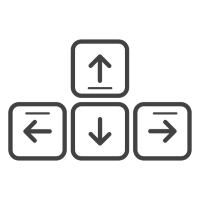
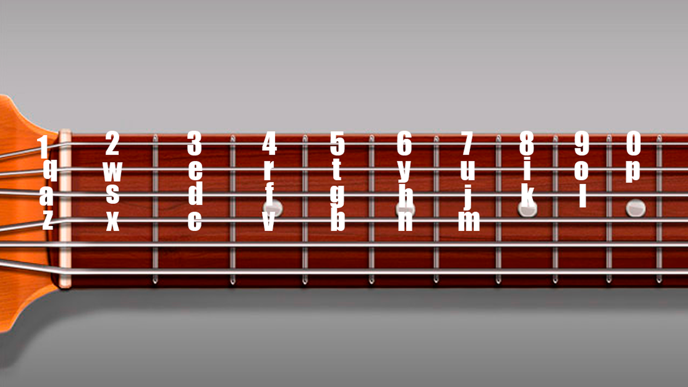
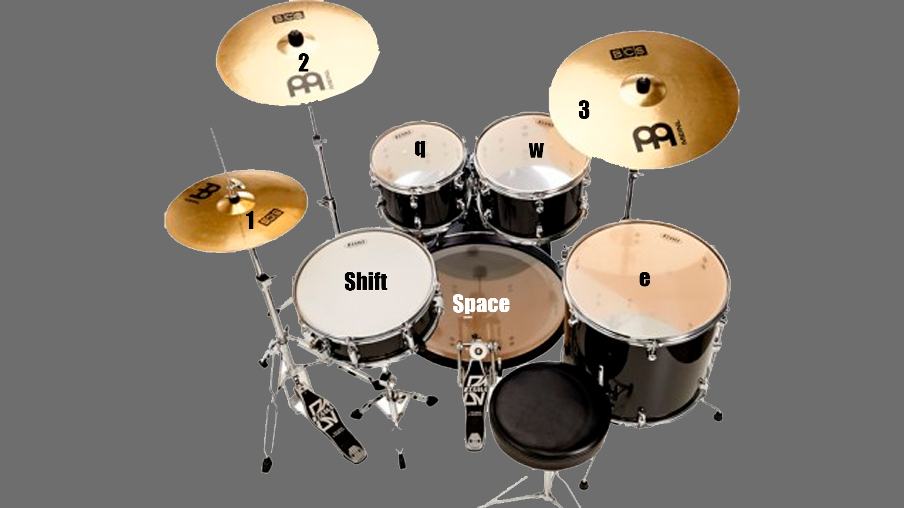

# **Пояснительная записка**

### Кнопки для перемещения:

###### 

### Взаимодействие с объектами и персонажами:

###### 
###### 

### Взаимодействие с виртуальной гитарой:

### Взаимодействие с виртуальными барабанами:

## Элементы настроек:

1. ### Сложность (настройка сложности игровых уровней)
2. ### Язык (выбор языка для игровых диалогов)
3. ### Громкость (настройком громкости внутриигровых звуков и музыки)